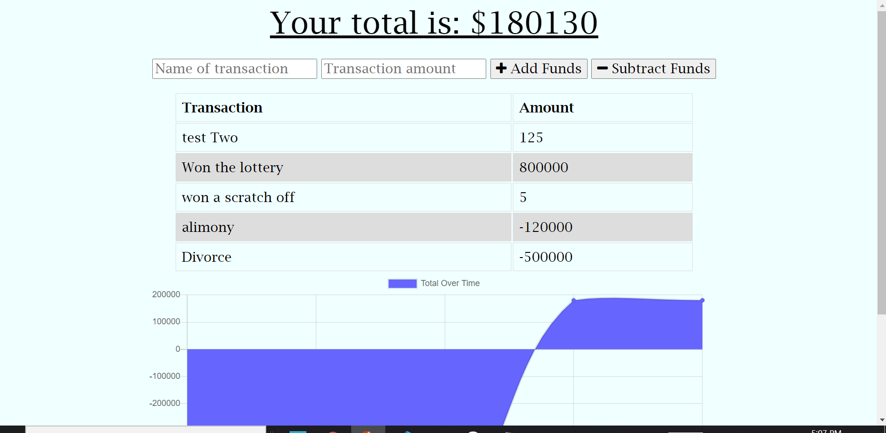

# Rachel-s-Budget-Tracker

## **Table of Contents**

- [User Story](#user-story)
- [Github Profile](#github-profile)
- [Heroku-Link](#heroku-link)
- [Contribution](#contribution)

### **User Story**

- AS AN avid traveler
- I WANT to be able to track my withdrawals and deposits with or without a data/internet connection
- SO THAT my account balance is accurate when I am traveling

### **Github Profile**

- https://github.com/rsolov23/Rachel-s-Budget-Tracker
- https://github.com/rsolov23

### **Heroku Link**

- https://vast-tundra-00537.herokuapp.com/

### **Contribution**

Feel free to contribute to this project in any of the following ways:

- [Submit bug and feature requests](https://github.com/rsolov23/Rachel-s-Budget-Tracker/issues)
- [Review Source Code Changes](https://github.com/rsolov23/Rachel-s-Budget-Tracker/pulls) and make pull requests from typos to content

Copyright (c) 2021 Rachel Solov
